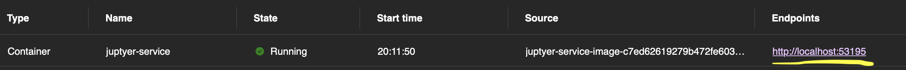
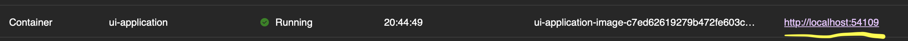
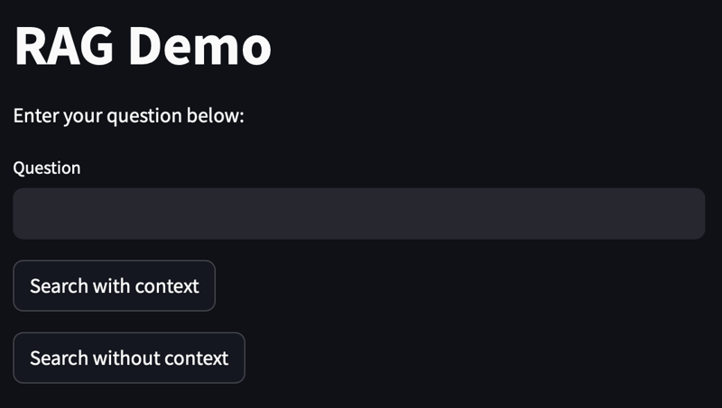
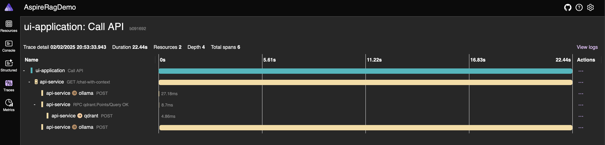

# Building a simple Retrieval Augmented Generation system using .Net Aspire

The code in this repository demonstrates building a minimal RAG system using a combination of .NET Aspire, Python and .NET.

Original Article link:

# Running the code samples

- Prerequisites
  - An up to date version of Visual Studio or Jetbrains Rider
  - Windows, Linux or MacOs running the ide.
- Clone the repository.
- Open src/AspireRagDemo.sln solution.
- Optionally configure the src/AspireRagDemo.AppHost/Properties/launchSettings.json file as documented below to use a different model.
- run the solution.

## Ingestion

- Click the link for the Jupyter notebook.
    
- When token required enter "secret" which is the token used for Jupyter server.
    
- Open the notebook /work/ingestion.ipynb in Jupyter UI.
- Run all of the cells (3)
  - First cell does the imports.
  - Second cell runs the ingestion.
  - Third cell runs 2 RAG queries to verify the operation.

## Query

Using the UI to run queries with or without context:

- in Aspire dashboard click the endpoint for ui-application
    
- Enter a .NET Aspire related question.
  - Example: What packages do I need to run Ollama as a host in .Net Aspire?
  - 
- Click on "Search with Context" or "Search without Context" buttons.
- View the results.

# Telemetry

You can view the logs and traces from Python and .Net applications in the Aspire dashboard as usual.

