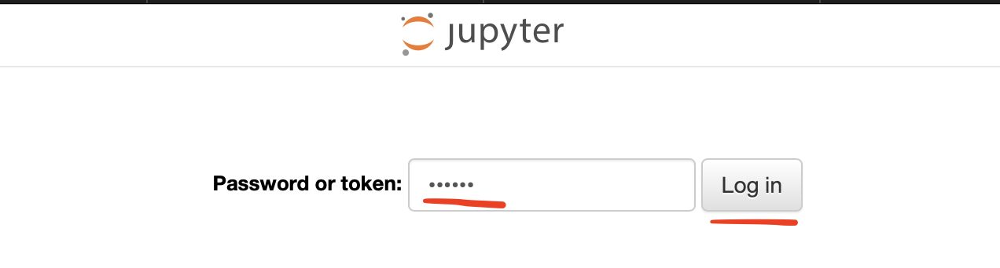

# Building a simple Retrieval Augmented Generation system using .Net Aspire

The code in this repository demonstrates building a minimal RAG system using a combination of .NET Aspire, Python and .NET.

Original Article link: https://dev.to/syamaner/building-a-simple-retrieval-augmented-generation-system-using-net-aspire-4pdp

# Running the code samples

- Prerequisites
  - An up to date version of Visual Studio or Jetbrains Rider
  - Windows, Linux or MacOs running the ide.
- Clone the repository.
- Open src/AspireRagDemo.sln solution.
- Optionally configure the src/AspireRagDemo.AppHost/Properties/launchSettings.json file as documented below to use a different model.
- run the solution.


## Ingestion

- Click the link for the Jupyter notebook.
    
- When token required enter "secret" which is the token used for Jupyter server.
    
- Open the notebook /work/ingestion.ipynb in Jupyter UI.
- Run all of the cells (3)
  - First cell does the imports.
  - Second cell runs the ingestion.
  - Third cell runs 2 RAG queries to verify the operation.

## Query

Using the UI to run queries with or without context:

- in Aspire dashboard click the endpoint for ui-application
    
- Enter a .NET Aspire related question.
  - Example: What packages do I need to run Ollama as a host in .Net Aspire?
  - 
- Click on "Search with Context" or "Search without Context" buttons.
- View the results.

# Telemetry

You can view the logs and traces from Python and .Net applications in the Aspire dashboard as usual.


# Supporting multiple models:

The main driver for our solution is the [launchSettings.json](./src/AspireRagDemo.AppHost/Properties/launchSettings.json) file included with Aspire Apphost project. By modifying this, all our components will utilise the desired models or providers. 

```json
{
  "$schema": "https://json.schemastore.org/launchsettings.json",
  "profiles": {
    "http": {
      "commandName": "Project",
      "dotnetRunMessages": true,
      "launchBrowser": true,
      "applicationUrl": "http://localhost:15062",
      "environmentVariables": {
        ....        
        "EMBEDDING_MODEL": "nomic-embed-text",
        "EMBEDDING_MODEL_PROVIDER": "Ollama",        
        "CHAT_MODEL": "mistral",
        "CHAT_MODEL_PROVIDER": "Ollama",        
        "VECTOR_STORE_VECTOR_NAME": "page_content_vector",
        ...
      }
    }
  }
}
```

List of models supported by Ollama: https://ollama.com/search

In this project, we can use the following values for EMBEDDING_MODEL_PROVIDER:
- Ollama : Spin up an Ollama Container using aspire and inject the connection string.
- OllamaHost : Do not spin up Ollama container and inject host.docker.internal to containers or localhost to the application executables.
- OpenAI: Inject the API key from secrets and use default OpenAI urls.
- HuggingFace: Inject API key from developer secrets and use default HuggingFace inference urls.

To use OpenAI or huggingFace, the following user secrets need to be set with valid keys:
Please note, nothing Python and .Net components will use default endpoints for these services and therefore connection strings are not used.

```json
{
  "Parameters:OpenAIKey": "",
  "Parameters:HuggingFaceKey": ""
}
```